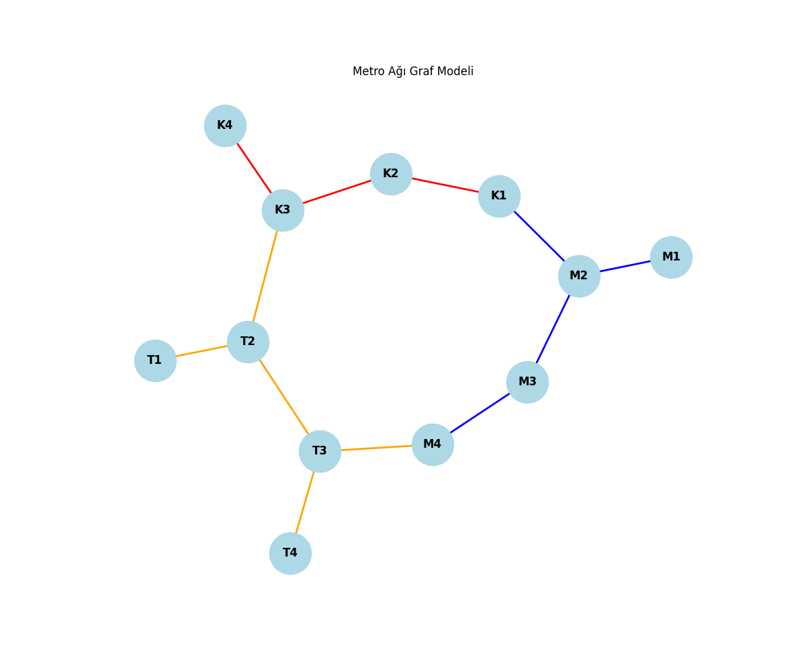

## Yapay Zeka ile Sürücüsüz Metro Simülasyonu (Rota Optimizasyonu)
Sürücüsüz Metro Simülasyonu ve Yapay Zekâ ile Rota Optimizasyonu: Gelişmiş algoritmalar ve teknolojiler kullanan bu yapay zekâ destekli proje, en az aktarmalı ve en hızlı rotaları hesaplayarak seyahat yollarını optimize eder ve örnek bir metro ağını hassasiyet ve verimlilikle modellemektedir.

## Kullanılan Teknolojiler ve Kütüphaneler
I. Teknolojiler  
-Yapay Zeka ile Rota Optimizasyonu  
-Ağ Modelleme ve Görselleştirme  
-Simülasyon ve Veri İşleme  

II. Programlama Dili ve Kütüphaneler  
-Python  
-Heapq: Heap veri yapısı üst düğümün (atasının) alt düğümlerden (çocuklarından) her zaman büyük olduğu bir ikili ağaç (binary tree) veri yapısıdır.  
-Collections(defaultdict): Veri yapıları için esnek depolama sağlar.  
-Matplotlib: Ağ modelleme için veri görselleştirme alanında kullanılır.  
-NetworkX: Ağ modelleme için kullanılır.  

III. Algoritmalar ve Optimizasyon  
-A* Algoritması: En hızlı rota hesaplamaları için kullanılır. A* Algoritması iki liste bazında çalışarak, ilk listedeki (Açık Liste) noktalara girer  veen düşük maliyetleri seçerek ikinci listeye (Kapalı Liste) taşır.  
-BFS (Breadth-First-Search): En az aktarmalı rota hesaplamaları için kullanılır. BFS Algoritması Graf ve ağaç yapısında aynı seviyedeki tüm düğümleri genişleterek arama yapar ve İlk Giren İlk Çıkar mantığı ile çalışan FIFO (First-In-First-Out) kuyruk çalışma prensibini kullanır.  
-Graph Traversal (Graf Geçiş Algoritmaları): Metro istasyonları arasındaki bağlantıları değerlendirmek için kullanılır.  

IV. Veri Yapıları, Modelleme ve GÖrselleştirme  
-Matplotlib ve NetworkX: Ağın renkli ve detaylı modellemenin oluşturulması.  
-Graf Tabanlı Modelleme: Ağ modellerinin içerisindeki düğüm ve bağlantıları kullanarak simülasyon oluşturulması.  

## 3. Algoritmaları Kullanma Amacımız  
Bu projede, metro ağında en hızlı ve en az aktarmalı rotaları belirlemek için A* ve BFS algoritmalarını seçtik. A*, ağırlıklı graf yapısında en kısa sürede hedefe ulaşan yolu bulmak için maliyet tahmini yaparak optimize edilmiş arama sağlar. BFS, ağırlıksız graf mantığında çalışarak en az durak değiştirerek ulaşılabilecek rotayı belirler. Ayrıca, graf veri yapısı kullanarak ağın doğru modellenmesini sağladık ve heapq ile öncelikli kuyruk yapısını kullanarak hesaplamaları daha verimli hale getirdik. Bu seçimler, yolculuk sürelerini optimize etmek ve aktarma sayısını minimize etmek için idealdir.

Bunların yanı sıra bu projeyi;  
-İyi bir kullanıcı arayüzü tasarımı,  
-Gerçek zamanlı veriler sunma ve konum erişimi entegresi,    
-Makine Öğrenmesi ile kullanıcı verilerini öğreterek veriye dayalı hareket etme gibi konular ile iyileştirebilir ve geliştirebiliriz.

## 4. Örnek Kullanım  

Kızılay'dan Keçiören'e en hızlı rota:  
```python
print("\n Kızılay'dan Keçiören'e:")
    rota = metro.en_az_aktarma_bul("K1","T4")
    if rota:
        print("En az aktarmalı rota:", " -> ".join(i.ad for i in rota))
    
    sonuc = metro.en_hizli_rota_bul("K1","T4")
    if sonuc:
         rota, sure = sonuc
         print(f"En hızlı rota {sure} dakika:", " -> ".join(i.ad for i in rota))
#----Çıktı----
#Kızılay'dan Keçiören'e:
#En az aktarmalı rota: Kızılay -> Ulus -> Demetevler -> Demetevler -> Gar -> Keçiören
#En hızlı rota 16 dakika: Kızılay -> Kızılay -> Sıhhiye -> Gar -> Gar -> Keçiören
```
## 5. Metro Ağ Simülasyonu



